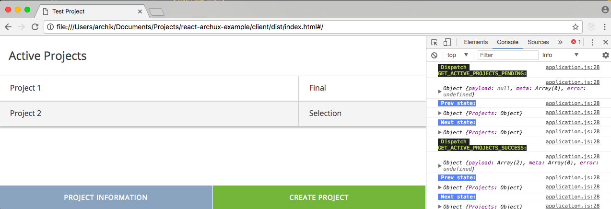

## Test Project Example (React.js + Archux)

>These are the depersonalized fragments from our real small project

>It is just for acquaintance with our approach and unidirectional data flow organization with react.js and archux (our little flux-implementation)

#### Infrastructure

+ `actions` - contains entity action functions, specific for archux

```javascript
/**
 * Perform getActiveProjects action
 *
 * @returns {void}
 */
export function performGetActiveProjects() {
  dispatcher.dispatchPromise(
    getActiveProjects,
    'GET_ACTIVE_PROJECTS',
    (state) => state.Projects.activeProjects.loading
  );
}
```

+ `services` - contains different services for local storage, api, app navigation ant etc.

+ `reducers` - contains pure functions for handling actions and updating store state

+ `store` - archux implementation (similar to flux and redux)


#### Component Types

We using pure, classic and functional react components and split they on following types:

+ `/components/_common` - *fundamental components* (like Buttons, Checkboxes, Selects);

+ `/components` - *specific components* for domain and project (like DataGrids, Sliders, Panels);

+ `/containers` - *top components* which works with data and subscribed to store (Pages, Modals);

#### Testing

We trying to test all aspects from components to services through reducers and actions:

+ `__tests__` - unit tests (using enzyme)

+ `e2e` - end-to-end and functional tests (using protractor and page-object pattern)

#### Documentation

We using beautiful tool for that - JSDoc


### Screen


